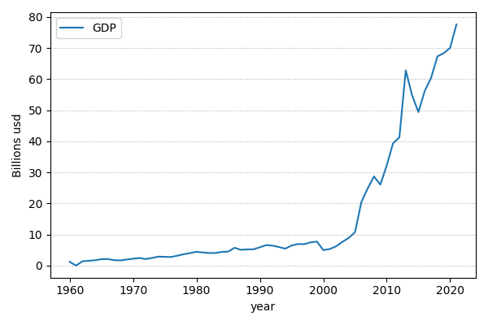
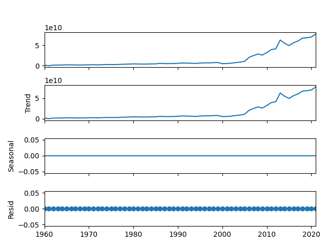
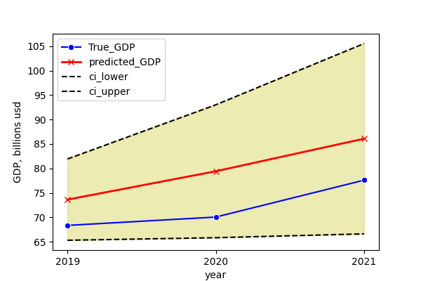

# GDP_forecast
Ghana' annual GDP modelling using several time series algorithms: ARIMA, GARCH, Prophet. It was estimated low volatility of predicted annual GDP change.

## Content

* [Summary](README.md#Summary)  
* [Project description](README.md#Project-description)  
* [Data and methods](README.md#Data-and-methods)                                
* [Project structure](README.md#Project-structure)

## Summary

## Project description
When the dataset is limited, it is needed to forecast a single non-linear feature that changes seasonally. Its modelling can be done by means of algorithms that were design for processing time series. The process might be illustrated using an original Ghana GDP dataset between years 1960 and 2020 in usd (fig.1). Modelling of such features usually starts from its decomposition into following components: trend, seasonality, and residuals (fig.2). As it can be seen, this feature might be splitted only by trend and residuals. It doesn't change seasonally that simplifies following analysis.

<table class="figures" align="center">
    <td>  <p align="center" ><font size="1">Fig.1 - Annual GDP of Ghana between the years 1960 and 2020</p></td>
    <td>  <p align="center" ><font size="1">Fig.2 - Feature decomposition</p></font></td>
</table>

## Data and methods

Let us split the dataset into train and test subsamples sequentialy. Then, let us use Autoregression model for predicting the test data (fig.6).


<div align="center">  </div>

As it might be seen, the prediction error of the model is relatively high. This might be caused by low size of the dataset since each data entry represents an annual GDP. In addition, the growth pace of annual GDP has trippled after 2000 year.

## Project structure

<details>
  <summary>display project structure </summary>

```
GDP_forecast
├── .git
├── .gitignore
├── config
│   └── config.json
├── data
│   └── ghana_gdp.zip
├── figures
├── LICENSE
├── models
├── notebooks
│   └── GDP_forecast.ipynb
├── README.md
├── utils
│   ├── config_reader.py
│   └── functions.py
└── requirements.txt
```